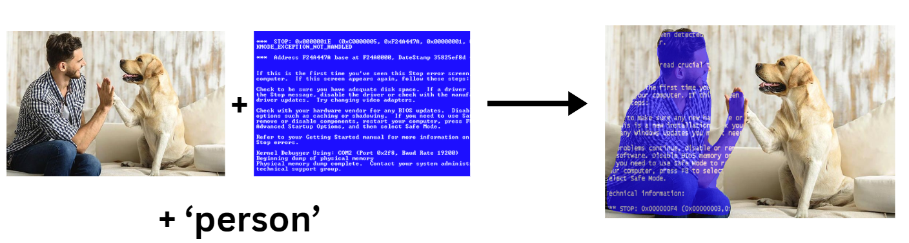
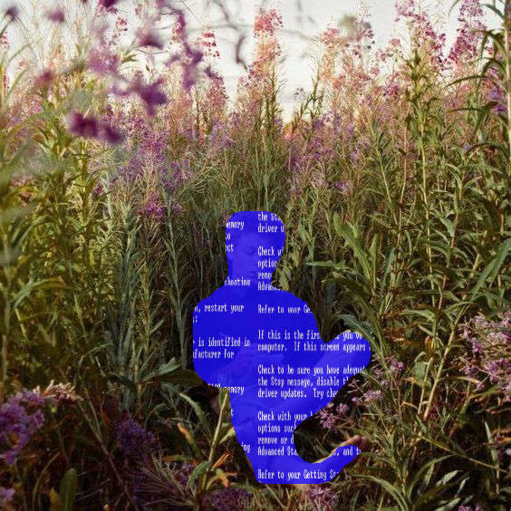

# Object Detection and Overlay Application

This application uses a pre-trained Mask R-CNN model to detect specified objects in images and applies an overlay (of any desired image) to those objects.



## Prerequisites

Before running the script, ensure you have Python installed along with the necessary libraries. You can install the required libraries using the `requirements.txt` provided in this repository.

```bash
pip install -r requirements.txt
```
<p align="center">
  
</p>

## Usage

To run the application, use the following command format in your terminal. The script takes the following arguments:

- `--input_image`: Path to the input image file.
- `--overlay_image`: Path to the overlay image file.
- `--object_to_detect`: Type of object to detect (e.g., "dog", "flower").
- `--output_dir`: Directory where the output image will be saved.


```bash
python overlay.py --input_image input/input.jpg --overlay_image overlay-effects/effect.jpg --object_to_detect person --output_dir output
```

to run the provided sample images:

```bash
python overlay.py --input_image input/dog.jpg --overlay_image overlay-effects/bsod.png --object_to_detect person --output_dir output
```


## Output

The processed image will be saved in the specified output directory with the name `output_image.png`. If no objects are detected, a message will be printed to the console.

## Connect with Me

[](https://github.com/DorsaRoh)
[](https://twitter.com/Dorsa_Rohani)
[](https://www.linkedin.com/in/dorsarohani/)

Feel free to contribute! 😊
